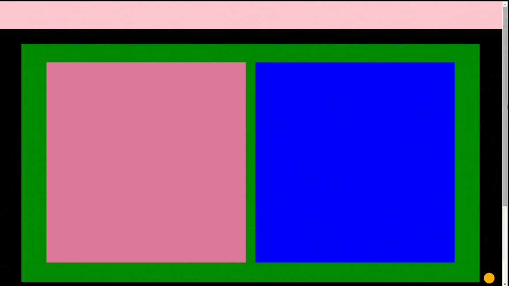

# Webpage Layout Project

## Introduction
This project is a simple webpage layout demonstration using HTML and CSS.

## Features
- Sticky header with navigation bar
- Main content area with two side-by-side boxes
- A welcome text box centered on the page
- A fixed position orange box at the bottom right corner
- A footer section

## Sample Layout GIF

## Project Description
This webpage layout project showcases a modern and responsive design using HTML and CSS. The layout features a sticky header with a navigation bar that remains at the top of the page as you scroll. The main content area is divided into two prominent boxes, side by side, set against a stark black background that highlights their colors. A welcoming text box is strategically placed in the center, inviting visitors to engage with the page. An orange action button, fixed at the bottom right corner, adds a playful touch and calls for interaction. The footer provides a clean finish to the page layout.

The design emphasizes usability and visual appeal, ensuring that each element is both functional and aesthetically pleasing. The use of vibrant colors against a dark background creates a striking contrast that captures attention, while the layout's structure guides the user's eye through the content seamlessly.

This project is perfect for those looking to understand the basics of web design and for developers seeking inspiration for their own projects.

## Technologies Used
- HTML5
- CSS3

## Setup
To view this project, open the `index.html` file in a web browser.

## License
This project is open source and available under the MIT License.
